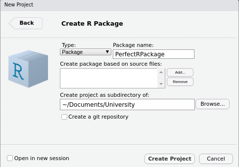
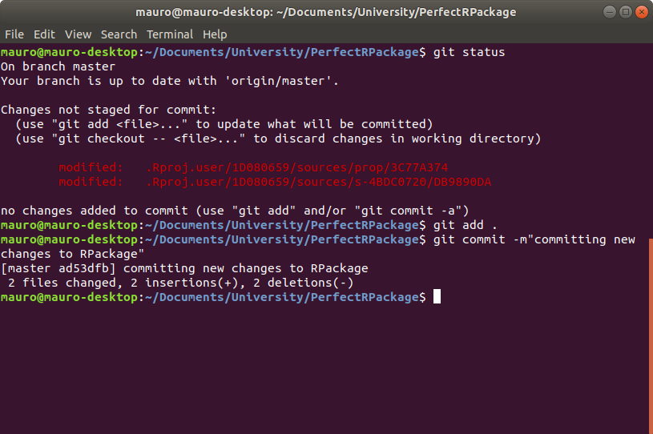

```{r setup, include=FALSE}
knitr::opts_chunk$set(echo = TRUE)
```


## Creating an R Package with RStudio
To Create a package open RStudio, on the menu browse

```
File > New Project > New Directory
```


Then, from the following options choose `R Package`.


At this point, we need to assign the R Package a name and tell RStudio where to place the main folder containing our package files without our folder structure. Here, I've chosen to put it under the folder `University` and to call it `PerfectRPackage`.



After this, RStudio will open a new session that should look like the following one, with a `hello.R` file and with a lot of new content such as

* `.Rbuildignore`
* `.Rproj.user`
* `DESCRIPTION`
* `man`
* `NAMESPACE`
* `PerfectRPackage.Rproj`
* `R`


Now it's time to create a GitHub repository. Browse inside the package directory, in this case called `PerfectRPackage` on the terminal. Type `git init` to initialize a repository, then follow it with `git add .` to stage all the new files created by RStudio when it created the package. Then, commit these staged changes using `git commit -m""` and put some helpful message in between `""`. It should look something like this


Now we need to create an upstream repository on GitHub. To do that, go on www.github.com, log in and click on the green button `New` to create a new repository


you will be directed to the following page where you can specify the name of the GitHub repository and add other details. I suggest naming it with the same name of the RPackage, in this case `PerfectRPackage`, to add a useful description, keep it Public, and to not initialize it with a README.md file just yet. Finally, click on the green button at the bottom saying `Create Repository`


Scroll to the bottom, and copy the following commands 


Now go back to your terminal, paste the commmands and this will connect the repository upstream.


Next, we want to add a `README.md` file. This will be the "welcome page" of our GitHub repository. To do so, simply go on the `PerfectRPackage` repository on GitHub and click on `Create New File` button on the right of the screen. This will load the following page. Call your file `README.md` and write some useful description.


Next, scroll to the bottom of the page, add a comment to describe what you're doing and commit to the master branch, as show in the following screenshot.


Click `Commit new file`. Next, we need to get these changes on our local version of the repository, so open up the terminal in the package directory, which is `PerfectRPackage` in this case. Type in `git status` to see what's going on in your local repository. If everything is up to date and you don't have any changes pending to be staged, simply type `git pull`. Otherwise, add your changes by typing `git add .` and then commit them with some useful message, using the command `git commit -m""` as shown below.



Next type 

```
git fetch origin --prune
```

followed by 

```
git rebase --preserve-merges origin/master
```

This will allow you to finally push your changes using `git push`. 


### Testing, Documentation, Licensing and README.md

First of all, we need to install some packages. Open RStudio, go to the console and type

```
install.packages(c("devtools", "roxygen2", "testthat", "knitr"))
```

When they're finished installing, simply load the `devtools` package by typing

```
library(devtools)
```

Now we want to add an author to the package. So type in something like this

```
mauro <- person(given="Mauro", family="Camara Escudero", email="maurocamaraescudero@gmail.com")
```

and assign it to the `author` variable by typing 

```
devtools.desc.author = mauro
```

Now it's time to add a LICENCE to our Package. The easiest way to add an MIT license is to type 

```
use_mit_license("Mauro Camara Escudero")
```

Now, we can add some documentation with Roxygen. To do this, simply open the `hello.R` script and click anywhere on the body of the `hello` function. Then, in the menu click

```
Code > Insert roxygen skeleton
```

To add a documentation skeleton. Remember to save the R script file. Now it's time to actually create the documentation. Since the file `NAMESPACE` was created by RStudio and not by Roxygen, we can delete such file for now. Then, go to the console and type 

```
document()
```

This will re-create the `NAMESPACE` file and add a new folder called `man`, containing markdown documents with the documentation. The next thing to do is to install the package. Go to the console and type 

``` 
install()
```

Next, we want to create some tests. Type

```
use_testthat()
```

and you should get an output that looks like this


To create a new test file for the function `hello` go to the console and type 

```
use_test("hello")
```
This will create a new file called `test-hello.R`, which will look like this


Modify this function to do a sensible test. For instance, give a sensible name and check that the function `hello` actually prints `Hello, World!`. It should look like this:


Now we can actually test our function. To do so, go to the console, load the `testthat` package by typing

```
library(testthat)
```

Then load the `PerfectRPackage` in the console by typing

```
load_all()
```

and test it using

```
test()
```

Hopefully, the test will be fine and you should obtain a summary of the testing that looks like this:


At this point you could push all the new changes to the upstream repository. Notice that if you did not create a `README.md` file, you can create it now together with its RMarkdown version by typing the following in the console

```
use_readme_rmd()
```

If you do this, remember to re-knit the README document before committing the changes. 

### Travis for Continuous Integration

To do continuous deployment, go on https://travis-ci.com/ and login with your GitHub account, granting access to the repositories for which you want continuous development. Next, create a new text file called `.travis.yml` and paste the following content

```
language: r
dist: xenial
cache: packages
branches:
  only:
    - master

r_github_packages:
  - r-lib/covr

after_success:
  - Rscript -e 'covr::codecov()'
```

commit the changes. From the **next** commit, travis will start building and testing your package. Go on the travis website and you should be able to see a screen looking like this


### Adding travis badge to GitHub readme

If you want to add a badge to your README.md file, simply go on the travis website shown above and click on the badge saying `build unknown`. Select `Markdown`


Copy the text in the last cell, go into your `README.rmd` file and type it under the comments saying where to add the badge, like shown in the picture below


Save the RMarkdown file. If everything went well, in the travis website you should now see a successful build. 


Finally, knit the `README.rmd` and then push your changes to the upstream directory, and you should then be able to see the badge on your README.md file on GitHub.

### Hosting a Website with Travis on GitHub pages

Go to GitHub and click on your profile image on the top right corner to toggle the menu. Click on `Settings` and then click to the bottom option `Developer Settings`. Here, click on `Personal access tokens` and click on `Generate new token`. Make sure that `public_repo` is selected.


Copy the token and go to the travis website. In the successful build, click on `More options` on the right of the screen and choose `Settings`. 


Scroll down to `Environment Variables`. Here, choose a name that will be used as a variable holding your personal access token. For instance  `GITHUB_PAT` and paste your Personal Access Token from github in the `value` box. Then click `Add`. In the following screenshot I show you where you should be adding this information, without actually adding it for security reasons


Now go into the `.travis.yml` file and change the content to 

```
language: r
dist: xenial
cache: packages
branches:
    only:
        - master
r_packages:
    - rmarkdown

script:
    - Rscript -e 'rmarkdown::render("website.Rmd", output_dir="public")'

deploy:
    provider: pages
    skip_cleanup: true
    github_token: $GITHUB_PAT
    on:
        branch: master
    local_dir: public
    target_branch: gh-pages
```

Make sure that the setting `github_token` is set to the same name that you've given to the github token on travis, in this case `GITHUB_PAT`. Notice how we've set `target_branch: gh-pages`. Go on GitHub and create a new branch called `gh-pages`. To do so, click `Branch:master` type `gh-pages` and click at the bottom where it says `Create branch: gh-pages`.


Finally, notice how we've told travis to build the website for `website.Rmd` RMarkdown file. This doesn't exist yet, so we'll create it now. Go to RStudio and create such file in the main folder `PerfectRPackage'. 


Finally, add, commit and push the changes so that travis can build the website. When travis build will be successful, your website will be available at https://mauroce.github.io/PerfectRPackage/website.html. 

### Adding Codecov Badge
To add a codecov badge, go to www.codecov.io and login with github. In the `PerfectRPackage` repository click on `Settings` and on `Badge` on the left hand side of the screen. Copy the code under Markdown, as shown below


and paste it under the travis build badge on the `README.Rmd` file. Knit it, add the changes, commit them and push them. If the build is successful, you should see a codecov badge on your `README.md` file on GitHub.


